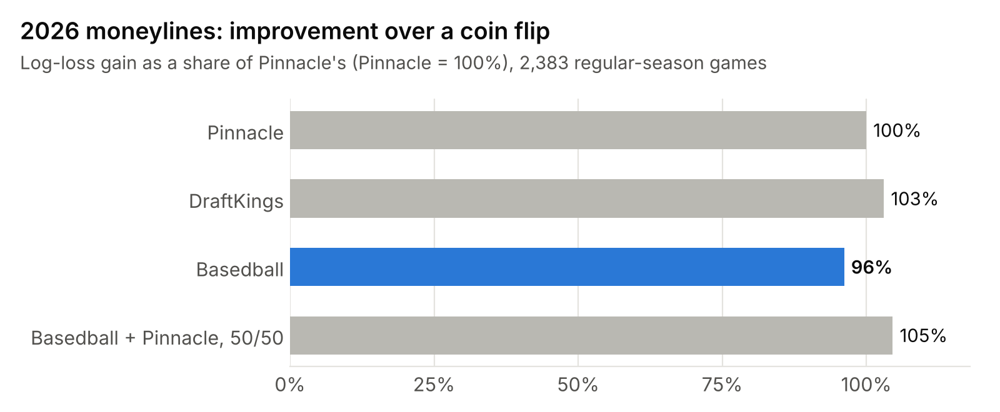
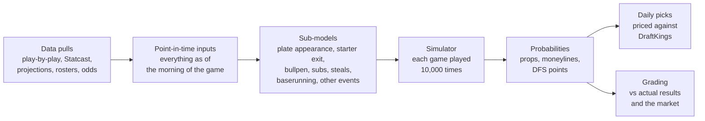
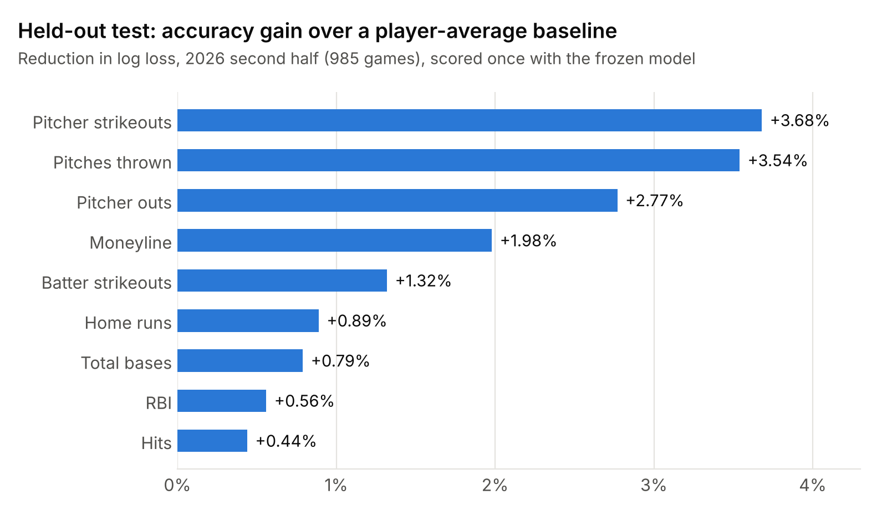

# Basedball

An MLB game simulator I built to price player props and moneylines. It plays every game out batter by batter, 10,000 times, using a separate model for each decision in a game: the plate appearance, when the starter gets pulled, who comes out of the bullpen, pinch hitters, steals, baserunning, even wild pitches and pickoffs.

This repo is the public write-up: results, how it works, the backstory and a sample of the code. The full pipeline, data and daily automation live in a private repo.

<picture>
  <source media="(prefers-color-scheme: dark)" srcset="images/moneyline_vs_books_dark.png">
  
</picture>

## Highlights

- **Close to the sportsbooks on moneylines.** Over the 2026 regular season (2,383 games), the model's win probabilities came within 0.0005 log loss of Pinnacle's, which works out to 96% of Pinnacle's improvement over a coin flip. A 50/50 blend of the model and Pinnacle beat both Pinnacle and DraftKings.
- **Level with the market on player props.** Across hits, total bases, RBI, H+R+RBI and pitcher strikeouts, the model's log loss was within 0.05% of DraftKings' no-vig prices in both 2025 and 2026, and ahead of it on RBI in both seasons.
- **Held-out test.** The second half of 2026 (985 games) was set aside, then scored once with the frozen model. It beat a player-average baseline on every priority stat, from +0.44% on hits to +3.68% on pitcher strikeouts.
- **A full game, not a stat projection.** Every in-game decision is its own model, trained on 2021–2024 play-by-play and kept only if it improved accuracy on seasons it hadn't seen.
- **Runs itself.** Nightly data pulls, lineup checks before each game, simulation and pricing run on GitHub Actions. A 15-game slate at 10,000 simulations takes about two minutes.

## The backstory

I've been obsessed with baseball since I was a kid. In 2020 I built the first version of Basedball: a Monte Carlo game simulator in Python, fed by stats I downloaded from FanGraphs and cleaned up in Tableau Prep and Excel. I used it for small, risk-averse prop bets and DraftKings lineups, and it had winning seasons in 2021, 2022 and 2023.

The problem was time. Every day meant downloading files, rebuilding the inputs and running the sim by hand, for bets that were never big enough to make that worthwhile. I shelved it in April 2024.

In 2026 I rebuilt it from scratch with two goals: it should run on its own, and every piece of it should be tested. The old simulator ran on fixed rules, like pulling the starter at a batters-faced target or always scoring a runner from second on a single. Each of those rules is now a model fitted on real play-by-play, and each one had to prove it made the predictions better before it went in.

## How it works

The simulator plays both teams batter by batter. Before each batter it checks, in order: does the manager change pitchers (and if so, who comes in), has the batter's spot been pinch-hit, does a runner try to steal, and is there a wild pitch, passed ball, balk or pickoff. Then it draws the plate appearance, its pitch count and where the runners end up. After 10,000 games it has a full distribution for every player's stat line and the game result, so any line can be priced: over 1.5 total bases, under 5.5 strikeouts, the moneyline.

### The plate appearance

The core of the simulator is the plate-appearance model. Every PA ends in one of ten outcomes: strikeout, walk, hit by pitch, single, double, triple, home run, reached on error, ground out or air out. A multinomial logistic regression gives the chance of each one, starting from the batter's and pitcher's own rates and adjusting them for 17 factors:

- **The matchup:** batter and pitcher platoon splits, how big the pitcher's platoon split should be given his release point and pitch mix, his pitch traits (velocity, movement, spin), and each player's last 30 days.
- **The game situation:** runners on base, outs, score margin, inning, home or away, and who's on deck (pitchers work around a hitter when a weaker one is up next).
- **The pitcher's workload:** times through the order, pitch count, and whether he's a starter or a reliever.
- **Conditions:** temperature and wind.
- **A pitcher correction:** how far his results have run from what the model expected over time.

The starting rates blend preseason projections (Steamer and ZiPS) with each player's results over five windows from 30 days to three years. Batted balls count by their exit velocity and launch angle, not just whether they fell for hits, and the park and quality of opponents are taken out before the day's park and matchup go back in. An in-season tracker follows league-wide shifts, like a year when home runs are down. Against a player-average baseline, the model cuts plate-appearance log loss by 0.8% in 2025 and 1.0% in the first half of 2026.

Every input is point-in-time: built as of the morning of the game from earlier dates only. I tested that by cutting all the stored data at a date, rebuilding, and checking the inputs matched the backtest's.

The pieces and what each one added are in [docs/MODEL.md](docs/MODEL.md).

## How I tested it

- **Train on 2021–2024.** All model weights are fitted on these four seasons.
- **One rule for every change.** A new factor or model goes in only if it improves 2025 by at least two standard errors and doesn't make the first half of 2026 worse.
- **Hold out the second half of 2026.** It was scored once, on October 3, 2026, with the frozen model. Later changes have been checked against it too, so it's no longer untouched.
- **Judge on accuracy, not profit.** The test is log loss and calibration against what actually happened. A season of bets is too noisy to tell a good model from a lucky one.
- **Benchmarks:** a player-average baseline, DraftKings' prices with the vig removed (taken 30–45 minutes before first pitch) and Pinnacle's for moneylines.

## Results

<picture>
  <source media="(prefers-color-scheme: dark)" srcset="images/heldout_gain_dark.png">
  
</picture>

**Moneylines, 2026 regular season (2,383 games).** Log loss, lower is better; a coin flip scores 0.6931.

| Prices | Log loss |
|---|---|
| DraftKings | 0.6797 |
| Pinnacle | 0.6801 |
| Basedball | 0.6806 |
| 50/50 blend of Basedball and Pinnacle | 0.6795 |

DraftKings' edge over Pinnacle here most likely comes from timing: its prices were taken 30 minutes before each game, while many of Pinnacle's were earlier.

**Player props vs DraftKings.** Difference in log loss against DraftKings' no-vig price at the posted line; positive means the model was more accurate. 2025 is a sample of 323 games.

| Market | 2026 | 2025 |
|---|---|---|
| All props | +0.05% | −0.04% |
| RBI | +0.10% | +0.38% |
| Hits | +0.16% | −0.17% |
| H+R+RBI | −0.05% | −0.05% |
| Total bases | −0.03% | −0.41% |
| Pitcher strikeouts | −0.22% | +0.45% |

For scale: a 0.1% gap needs about 20,000 lines in a market to tell apart from noise, so these are judged over full seasons, never a few weeks.

## What it doesn't do yet

- **Moneylines in 2025.** The model trailed DraftKings that season (0.6814 vs 0.6751). Most of the gap is team strength: when the two disagree, the market knows more about the whole team than the player-level inputs add up to. Team-level terms added in October 2026 (in-season defense, schedule fatigue, and how well a team turns its plate appearances into runs) closed about a fifth of it.
- **Props are benchmarked against DraftKings only.** Pinnacle posts few MLB player props; a test pull found only total bases, home runs and pitcher strikeouts.
- **Known misses on the list:** simulated batter strikeouts run a little high, managers are pulling starters earlier than the model expects in the first 85 pitches, and pinch runners and openers aren't modeled yet.

## Betting

It's built for betting, but I judge it on accuracy. A backtest on about 178,000 DraftKings lines from 2026 made money at most edge thresholds with flat stakes (+1.7% return at a 4% edge, +3.4% at 6%), but those results are within one to two standard errors of zero, and the 2025 moneylines lost money. One season can't prove an edge either way, which is why the accuracy numbers above are the real test.

## Code sample

[`code-sample/`](code-sample) has a few files from the private repo, to read rather than run (they depend on the data pipeline):

- [`basedball/sim/engine.py`](code-sample/basedball/sim/engine.py): the game simulator, vectorized over games and simulations.
- [`basedball/model/exit.py`](code-sample/basedball/model/exit.py): the starter-exit model, the chance the manager pulls the starter before each batter.
- [`basedball/model/mnl.py`](code-sample/basedball/model/mnl.py): the multinomial logistic regression behind the plate-appearance model.
- [`basedball/eval/grade.py`](code-sample/basedball/eval/grade.py): how every model is graded (log loss, Brier score at prop lines, calibration).
- [`basedball/eval/actuals.py`](code-sample/basedball/eval/actuals.py): actual results from the play-by-play, for grading.

## Data

No data is stored in this repo. The model uses:

- **Retrosheet** for play-by-play of completed seasons.
- **MLB Stats API** for current-season play-by-play, box scores, lineups and rosters.
- **Baseball Savant** for Statcast batted-ball, pitch and fielding data.
- **FanGraphs** for preseason projections (Steamer and ZiPS) and pitch-quality metrics.
- **The Odds API** for historical DraftKings and Pinnacle lines.
- **RotoWire** for projected lineups before they're posted.

The information used here was obtained free of charge from and is copyrighted by Retrosheet. Interested parties may contact Retrosheet at www.retrosheet.org.

---

© 2026 Mark Max. Shared for viewing; all rights reserved.
